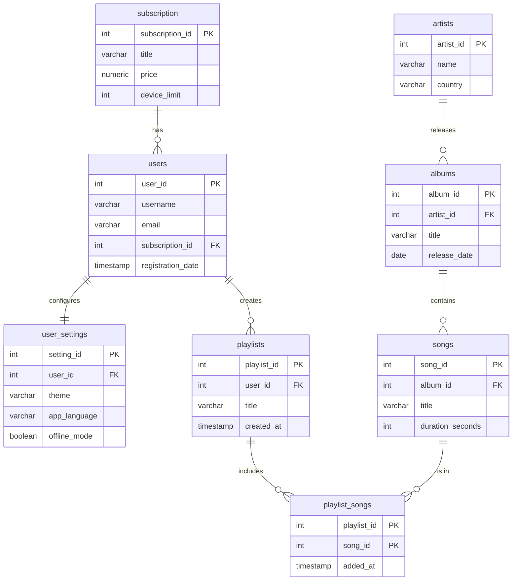

```mermaid
erDiagram
    subscription ||--o{ users : "has"
    users ||--|| user_settings : "configures"
    users ||--o{ playlists : "creates"
    artists ||--o{ albums : "releases"
    albums ||--o{ songs : "contains"
    playlists ||--o{ playlist_songs : "includes"
    songs ||--o{ playlist_songs : "is in"

    subscription {
        int subscription_id PK
        varchar title
        numeric price
        int device_limit
    }
    users {
        int user_id PK
        varchar username
        varchar email
        int subscription_id FK
        timestamp registration_date
    }
    user_settings {
        int setting_id PK
        int user_id FK
        varchar theme
        varchar app_language
        boolean offline_mode
    }
    artists {
        int artist_id PK
        varchar name
        varchar country
    }
    albums {
        int album_id PK
        int artist_id FK
        varchar title
        date release_date
    }
    songs {
        int song_id PK
        int album_id FK
        varchar title
        int duration_seconds
    }
    playlists {
        int playlist_id PK
        int user_id FK
        varchar title
        timestamp created_at
    }
    playlist_songs {
        int playlist_id PK
        int song_id PK
        timestamp added_at
    }
```
