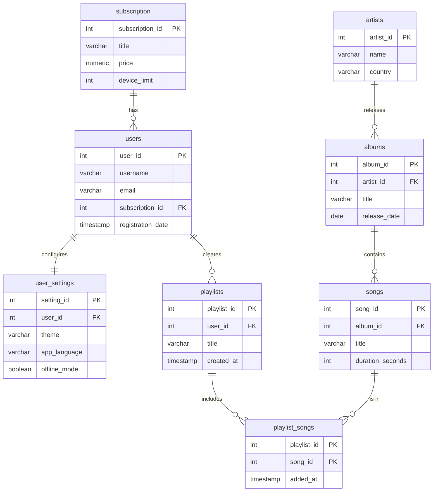

explain analyze

Щоб продемонструвати роботу індексування баз даних, я провела тестування продуктивності на таблиці songs, в яку додала 500 000 записів.

До індексації: 

До створення індексів база даних виконувала повне сканування таблиці. 
Тип сканування: Parallel Seq Scan (Паралельне послідовне сканування).
Час виконання: 21.095 ms

Після індексації:

Я додала індекси для всіх зовнішніх ключів. Планувальник запитів використав створений індекс, щоб миттєво знайти точне розташування записів.
Тип сканування: Bitmap Index Scan (Сканування за індексом).
Час виконання: 0.110 ms

